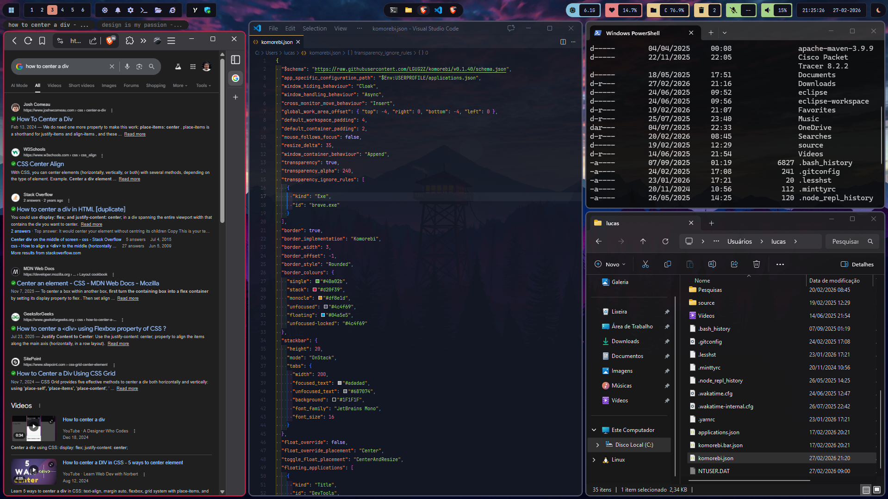
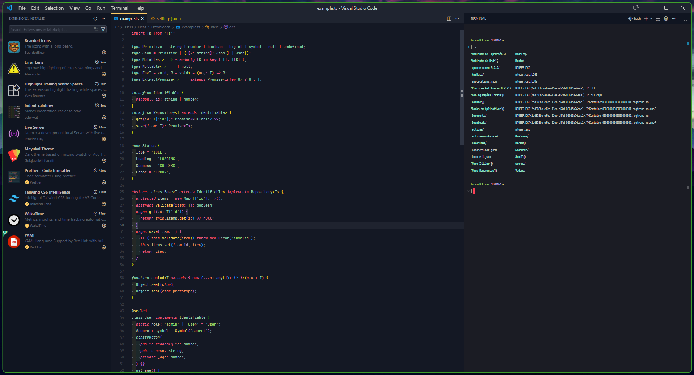
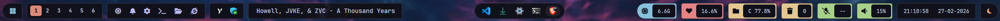

# Repository Overview

This repository is a structured and centralized **collection of my personal
system configurations, workflow customizations, and environment-level
adjustments** for development tools and general software setups.

**The primary objective of this project is not instructional**. It is not
intended to replace official documentation or provide comprehensive step-by-step
guides. Instead, **it functions as a curated archive of ready-to-use
configuration files** that represent how I structure, optimize, and maintain my
working environment.

To maintain consistency across different tools and components, **each section of
this repository may follow a standardized documentation structure**. When
applicable, the following topics are used:

- `Overview`: A brief description of what the tool or tweak is, its main
  purpose, and why it is relevant. May include a link to the official
  documentation and minimal installation guidance when necessary.

- `Configurations`: Links to the configuration files provided in this
  repository, with a short explanation of their structure and what aspects of
  the tool they control.

- `Inspirations`: References to themes, repositories, or style guides that
  influenced the visual design or structural approach, when applicable.

- `Tips`: Practical notes and small technical clarifications that help avoid
  common mistakes or improve compatibility and usability.

- `Known Issues`: A short summary of limitations or edge cases, with links to
  official documentation or issue trackers when relevant.

The emphasis is on standardization, organization, and portability. **All files
are grouped into dedicated directories with clear naming conventions**, ensuring
that the repository remains maintainable and easy to navigate. The structure is
intentionally uniform to reduce friction for anyone who wants to reuse or adapt
the configurations.

If you find any part of this repository useful, feel free to copy, adapt, or
fork it according to your own requirements. **It should be viewed as a practical
reference implementation rather than a prescriptive standard**.

<!-- prettier-ignore-start -->
> [!IMPORTANT]
> Some configurations may assume familiarity with the associated tools, as the
> focus is on sharing finalized setups rather than explaining every individual
> configuration decision.
<!-- prettier-ignore-end -->

 

# Table of Contents

- [Komorebi](#komorebi)
- [Style Overrides](#style-overrides)
- [VS Code](#vs-code)
- [YASB - Yet Another Status Bar](#yasb---yet-another-status-bar)

 
 

<!-- --- --- Komorebi --- --- --- --- --- --- --- --- --- --- --- --- --- --- --- --- -->

## Komorebi

### Overview

[**`Komorebi`**](https://github.com/LGUG2Z/komorebi) **is a tiling window
manager for Windows** that automatically organizes open application windows into
structured layouts. Instead of manually resizing and positioning windows, it
arranges them in predefined tiling patterns, improving productivity and workflow
efficiency. It is especially useful for users who prefer keyboard-driven
navigation and a more organized desktop experience.

To install Komorebi, **you can download it directly from the official repository
or install it using a package manager**. After installation, you may need to
configure it and set it to start with Windows. Since the steps can vary, it’s
important to follow the official
[**`documentation`**](https://komorebi-starlight.lgug2z.workers.dev/guides/installation/)
to ensure everything is set up correctly.

<!-- prettier-ignore-start -->
> [!WARNING]
> The documentation provides important recommendations, such as:
> [**`enabling long path support`**](http://komorebi-starlight.lgug2z.workers.dev/guides/installation/#suggested-system-settings)
> and
> [**`disabling unnecessary system animations`**](https://lgug2z.github.io/komorebi/installation.html#disabling-unnecessary-system-animations).
<!-- prettier-ignore-end -->

### Configurations

You can access my configuration file here:

- [**`komorebi.json`**](./komorebi/komorebi.json)
- [**`whkdrc`**](./komorebi/whkdrc)

Komorebi is configured primarily through the
[**`komorebi.json`**](https://komorebi-starlight.lgug2z.workers.dev/reference/komorebi-windows/)
file, where you define layouts, workspace behavior, window rules, and general
manager settings. This file controls how windows are arranged, how many
workspaces are available, and how specific applications should behave.

A
[**`whkdrc`**](https://lgug2z.github.io/komorebi/example-configurations.html#whkdrc)
file is used by [**`WHKD`**](https://github.com/LGUG2Z/whkd), a Windows hotkey
daemon, to map key combinations to commands. WHKD essentially runs
[**`Komorebic`**](https://komorebi-starlight.lgug2z.workers.dev/reference/komorebic-windows/)
in the background, interpreting the whkdrc bindings and executing actions. In
Komorebi, it manages shortcuts for controlling the window manager, such as
changing layouts, moving windows, switching workspaces, and resizing containers.

Here is a table showing the **keybindings** from my personal whkdrc
configuration:

| Shortcut                    | Action Description                     |
| --------------------------- | -------------------------------------- |
| alt + escape                | Close the current window               |
| alt + a                     | Move focus to the window on the left   |
| alt + s                     | Move focus to the window below         |
| alt + w                     | Move focus to the window above         |
| alt + d                     | Move focus to the window on the right  |
| win + a                     | Shift the current window left          |
| win + s                     | Shift the current window down          |
| win + w                     | Shift the current window up            |
| win + d                     | Shift the current window right         |
| alt + space                 | Swap or promote the current window     |
| alt + z                     | Toggle floating mode                   |
| alt + x                     | Toggle monocle mode (maximized window) |
| alt + r                     | Stack the window to the left           |
| alt + f                     | Stack the window downward              |
| alt + t                     | Stack the window upward                |
| alt + g                     | Stack the window to the right          |
| alt + c                     | Remove window from stack               |
| alt + q                     | Go to previous stacked window          |
| alt + e                     | Go to next stacked window              |
| alt + oem_plus (+)          | Widen window horizontally              |
| alt + oem_minus (-)         | Narrow window horizontally             |
| alt + shift + oem_plus (+)  | Increase window height                 |
| alt + shift + oem_minus (-) | Decrease window height                 |
| alt + 1                     | Switch to workspace 0                  |
| alt + 2                     | Switch to workspace 1                  |
| alt + 3                     | Switch to workspace 2                  |
| alt + 4                     | Switch to workspace 3                  |
| alt + 5                     | Switch to workspace 4                  |
| alt + 6                     | Switch to workspace 5                  |
| win + 1                     | Move window to workspace 0             |
| win + 2                     | Move window to workspace 1             |
| win + 3                     | Move window to workspace 2             |
| win + 4                     | Move window to workspace 3             |
| win + 5                     | Move window to workspace 4             |
| win + 6                     | Move window to workspace 5             |
| alt + j                     | Switch to the next layout              |
| alt + k                     | Switch to the previous layout          |

<!-- prettier-ignore-start -->
> [!WARNING]
> In my komorebi.json config, I use the
> [**`JetBrains Mono`**](https://www.jetbrains.com/lp/mono/) font. You can
> change it to any font you like.
<!-- prettier-ignore-end -->

### Tips

#### Windows Virtual Keys

In my whkdrc for Komorebi, **I use OEM keys (`oem_1`, `oem_plus`, `oem_102`,
etc.) for shortcuts**. They let me map layout-specific characters, ensuring my
keybindings work across different keyboard layouts.

On Windows, keys like `oem_1`, `oem_plus`, and `oem_102` refer to **OEM
(Original Equipment Manufacturer) keys**. These are layout-dependent keys,
usually punctuation or special character keys, whose output changes depending on
the keyboard language (for example ;, `` ` ``, `~`, `[`, `]`, etc.). The
numbering follows **Windows virtual-key codes**. The number does not represent
the printed symbol, but a layout-specific key position. Because of that, the
**mapped character can vary from country to country**.

To determine the correct OEM value, use the
[**`kbdlayout`**](https://kbdlayout.info/) website, which provides the
virtual-key code associated with each key in a specific keyboard layout.

For reference, consult the official Microsoft documentation for the
[**`United States Keyboard Layout`**](https://learn.microsoft.com/en-us/windows/win32/inputdev/virtual-key-codes)
to review the standard virtual-key definitions. If you are working with a
different keyboard layout, such as
the[**`Brazilian Keyboard Layout (ABNT2)`**](https://kbdlayout.info/KBDBR/virtualkeys),
you can use the kbdlayout website as previously described to look up the
corresponding virtual-key mappings and OEM values.

### Known Issues

Komorebi has a few known issues, such as occasional inconsistencies after waking
from sleep, minor crashes in edge cases, and problems with window placement when
using multiple workspaces. These issues are actively being addressed, and
updates often improve stability and performance.

<!-- prettier-ignore-start -->
> [!WARNING]
> Many common issues are already explained in the
> [**`documentations`**](https://komorebi-starlight.lgug2z.workers.dev/guides/known-issues/)
<!-- prettier-ignore-end -->

 
 

<!-- --- --- Style Overrides --- --- --- --- --- --- --- --- --- --- --- --- --- --- --- --- -->

## Style Overrides

### Overview

The goal of this section is to create **CSS style overrides that modify parts of
the HTML page to make content easier to see, improve readability, and enhance
the overall user experience**. These custom styles aim to make the page simpler
and more pleasant to interact with.

To implement the **custom CSS configurations listed below**, you can use the
Stylus browser extension or any other extension that allows injecting custom
styles into web pages. **The following steps guide you through creating a new
style and configuring it for the desired website**:

1. Install the
   [**`Stylus`**](https://chromewebstore.google.com/detail/stylus/clngdbkpkpeebahjckkjfobafhncgmne)
   extension from the Chrome Web Store .
2. Open the Chrome extensions page and select `Manage` for Stylus.
3. Click the `Write new style` button (or the `+` icon) to create a new style.
4. Assign a descriptive name to the style you are creating.
5. Paste your CSS code into the provided code editor.
6. Set the style’s target by selecting `URLs starting with` and entering the
   appropriate website `URL` (e.g., `https://www.google.com`).
7. Save the style by clicking the `Save` button or pressing `Ctrl + S`.

### Configurations

You can access my configuration file here:

- [**`google-center-searchResults.css`**](./style-overrides/google-center-searchResults.css)
  ([**`PREVIEW`**](./style-overrides/preview-google.png))
- [**`youtube-center-commentsSection.css`**](./style-overrides/youtube-center-commentsSection.css)
  ([**`PREVIEW`**](./style-overrides/preview-youtube.png))

#### Google Center Search Results

This CSS code customizes the Google search results page. It centers all content,
limits the main page width, and keeps the floating search bar aligned in the
center. It also hides extra elements like “People also search for,” the AI Mode
option, and the footer, while preventing the search bar from stretching too much
when focused.

#### Youtube Center Comments Section

This CSS code adjusts the YouTube comments section by limiting its width and
centering it on the page, making the comments easier to read and visually
balanced.

### Known Issues

Since these styles are injected via CSS, some page elements might not display
correctly or could behave unexpectedly. If you encounter any issues, you can
easily resolve them by disabling Stylus or any other extension that injects
custom CSS into pages.

 
 

<!-- --- --- VS Code --- --- --- --- --- --- --- --- --- --- --- --- --- --- --- --- -->

## VS Code

### Overview

[**`VS Code`**](https://code.visualstudio.com/) is a **lightweight,
cross-platform code editor developed by Microsoft**. It supports multiple
programming languages, has a powerful extension ecosystem, and provides built-in
tools like debugging, Git integration, and a terminal, making it a versatile
environment for both development and everyday coding tasks.

You can download VS Code directly from its
[**`official website`**](https://code.visualstudio.com/Download). Installation
is straightforward: **choose your operating system, run the installer, and
follow the prompts**. Once installed, you can launch the editor immediately and
start coding.

### Configurations

You can access my configuration file here:

- [**`settings.json`**](./vscode/settings.json)

In VS Code,
[**`settings.json`**](https://code.visualstudio.com/docs/configure/settings) is
the main configuration file where **you can customize the editor’s appearance
and behavior, including themes, fonts, tab size, auto-save, and
language-specific settings**. This file gives you full control over VS Code,
allowing you to tailor both how it looks and how it responds to your workflow.

In order for the settings to work properly, **install the following extensions**
(if you don’t want to use any of them, simply remove them from the
`settings.json` file):

| Name                      | Functionality                                       | Download Link                                                                                             |
| ------------------------- | --------------------------------------------------- | --------------------------------------------------------------------------------------------------------- |
| Git Bash                  | Terminal shell for Git commands on Windows          | [**`Download`**](https://git-scm.com/downloads)                                                           |
| JetBrains Mono            | Programming font used in editor and terminal        | [**`Download`**](https://www.jetbrains.com/lp/mono/)                                                      |
| Error Lens                | Highlights errors and warnings inline in the editor | [**`Download`**](https://marketplace.visualstudio.com/items?itemName=usernamehw.errorlens)                |
| Bearded Icons             | Icon theme for VS Code                              | [**`Download`**](https://marketplace.visualstudio.com/items/?itemName=BeardedBear.beardedicons)           |
| Mayukai Mono              | VS Code color theme                                 | [**`Download`**](https://marketplace.visualstudio.com/items/?itemName=GulajavaMinistudio.mayukaithemevsc) |
| Prettier - Code formatter | Formats code automatically according to style rules | [**`Download`**](https://marketplace.visualstudio.com/items/?itemName=esbenp.prettier-vscode)             |
| Red Hat YAML              | YAML language support and formatter                 | [**`Download`**](https://marketplace.visualstudio.com/items/?itemName=redhat.vscode-yaml)                 |

## Tips

The following extensions are not included in the `settings.json` configuration,
but I highly recommend them as they are very useful for improving productivity
and code readability.

| Name                            | Functionality                                     | Download Link                                                                                                  |
| ------------------------------- | ------------------------------------------------- | -------------------------------------------------------------------------------------------------------------- |
| Highlight Trailing White Spaces | Highlights trailing whitespace in files           | [**`Download`**](https://marketplace.visualstudio.com/items/?itemName=ybaumes.highlight-trailing-white-spaces) |
| indent-rainbow                  | Colors indentation levels for better readability  | [**`Download`**](https://marketplace.visualstudio.com/items/?itemName=oderwat.indent-rainbow)                  |
| WakaTime                        | Tracks coding activity and time spent on projects | [**`Download`**](https://marketplace.visualstudio.com/items/?itemName=WakaTime.vscode-wakatime)                |

 
 

<!-- --- --- YASB --- --- --- --- --- --- --- --- --- --- --- --- --- --- --- --- -->

## YASB - Yet Another Status Bar

### Overview

[**`YASB (Yet Another Status Bar)`**](https://github.com/amnweb/yasb) is a
**customizable status bar for Windows** that displays system information and
dynamic data directly on the desktop. It is lightweight, flexible, and
configurable through external configuration files, allowing users to tailor the
layout, styling, and displayed information, including system metrics and
external data sources.

To install YASB, **download the latest release from the official repository or a
package manager**, then follow the setup instructions in the
[**`documentation`**](https://docs.yasb.dev/latest/installation). The
installation process generally requires extracting the files, executing the
application, and configuring it according to your system specifications.

### Configurations

You can access my configuration file here:

- [**`config.yaml`**](./yasb/config.yaml)
- [**`style.css`**](./yasb/styles.css)

YASB is configured through a
[**`YAML file (default)`**](https://github.com/amnweb/yasb/blob/main/src/config.yaml)
that uses simple key value pairs organized by indentation, with nested settings
structured hierarchically to group related options under broader categories. In
addition to the configuration file, YASB also uses a
[**`CSS file (default)`**](https://github.com/amnweb/yasb/blob/main/src/styles.css)
to define the visual appearance of the bar, including colors, spacing, fonts,
and overall layout.

YASB provides many configuration options for customizing its
[**`behavior`**](https://docs.yasb.dev/latest/configuration),
[**`keybinds`**](https://docs.yasb.dev/latest/keybindings) and
[**`appearance`**](https://docs.yasb.dev/latest/styling). In this guide, I will
focus on the most important components, the **widgets**, as they are the core
elements of the interface.

The [**`widgets`**](https://docs.yasb.dev/latest/widgets/active-windows-title)
present in my configuration are:

| Widget Name               | Description                                                                                |
| ------------------------- | ------------------------------------------------------------------------------------------ |
| Custom (Super Start Menu) | Custom start menu button that triggers the system start menu when left-clicked.            |
| Komorebi Workspaces       | Displays Komorebi workspaces and allows switching between them.                            |
| Applications              | Shows custom application shortcuts with clickable icons for launching predefined apps.     |
| Systray                   | Displays the system tray with background applications and status icons.                    |
| Media                     | Shows current media playback information with optional controls and dropdown media menu.   |
| Taskbar                   | Displays open windows and allows interaction such as toggling or opening the context menu. |
| Memory                    | Shows current memory usage with an alternative detailed view toggle.                       |
| CPU                       | Displays CPU usage percentage with optional frequency view.                                |
| Disk                      | Shows disk usage information for a specified volume.                                       |
| Recycle Bin               | Displays recycle bin status including item count and size.                                 |
| Microphone                | Shows microphone level and mute status with a dropdown device menu.                        |
| Volume                    | Displays system volume level with mute toggle and expandable audio menu.                   |
| Clock                     | Shows current time and date with an alternate format toggle.                               |
| Power Menu                | Provides a popup menu with power options such as lock, restart, and shutdown.              |

<!-- prettier-ignore-start -->
> [!NOTE]
> Most animations and tooltips are disabled!
<!-- prettier-ignore-end -->

### Inpirations

The design of YASB was created entirely from scratch, handcrafted without
copying anyone else's code. **While the implementation is original, the visual
style was inspired by a few existing themes and concepts**. The table below
highlights some of the key inspirations that influenced the look and feel of
YASB.

| Theme Name        | Visual Appearance                                                                                                    | Theme Source                                                                                                    |
| ----------------- | -------------------------------------------------------------------------------------------------------------------- | --------------------------------------------------------------------------------------------------------------- |
| Spectrum Symphony | [**`Image`**](https://github.com/amnweb/yasb-themes/blob/main/themes/edb987a6-0df1-43c6-b274-0393bf469bf1/image.png) | [**`Repository`**](https://github.com/amnweb/yasb-themes/tree/main/themes/edb987a6-0df1-43c6-b274-0393bf469bf1) |
| Soft Segment      | [**`Image`**](https://github.com/amnweb/yasb-themes/blob/main/themes/f60c809d-1378-4042-9f11-46d0e9c37cf5/image.png) | [**`Repository`**](https://github.com/amnweb/yasb-themes/tree/main/themes/f60c809d-1378-4042-9f11-46d0e9c37cf5) |
| Pillbox           | [**`Image`**](https://github.com/amnweb/yasb-themes/blob/main/themes/e675b585-4fad-4056-89ba-e318faeadab5/image.png) | [**`Repository`**](https://github.com/amnweb/yasb-themes/tree/main/themes/e675b585-4fad-4056-89ba-e318faeadab5) |
| Fluent Onyx       | [**`Image`**](https://github.com/amnweb/yasb-themes/blob/main/themes/80198c48-f70a-44a1-8507-ce300ff8e360/image.png) | [**`Repository`**](https://github.com/amnweb/yasb-themes/tree/main/themes/80198c48-f70a-44a1-8507-ce300ff8e360) |

In addition to the visual inspirations listed above, the color palette of YASB
was primarily based on the [**`Catppuccin`**](https://catppuccin.com/palette/)
theme, and its official
[**`style guide`**](https://github.com/catppuccin/catppuccin/blob/main/docs/style-guide.md)
was also used as a reference. This combination provides a soft and harmonious
range of tones that enhances readability and ensures overall aesthetic
consistency.

### Tips

#### Comunity Themes

If you want, **you can customize YASB by editing the configuration files to suit
your own needs and preferences**. For those who prefer ready-made visuals, there
is also a repository of
[**`community-made themes`**](https://github.com/amnweb/yasb-themes) that you
can download. Applying a theme from the repository changes the entire appearance
of YASB instantly, without needing to modify any code.

#### UWP

In the yasb configuration file, you can set icons for each widget using Unicode
codes like `\uf1f8`, `\uec04`, or `\uf4bc`. These codes represent **glyphs from
an icon font**, often provided by patched fonts like
[**`Nerd Fonts`**](https://www.nerdfonts.com/), allowing the widget to display a
symbol alongside dynamic information such as CPU usage, disk space, or recycle
bin status. Wrapping the code in a  tag ensures it renders correctly, and
you can switch to alternate labels using mouse actions.

[**`UWP (Universal Windows Platform)`**](https://github.com/character-map-uwp/Character-Map-UWP)
provides a modern, native replacement for traditional Win32 tools like the
Character Map and Windows Font Viewer. With full high-DPI and touch support,
**it lets you easily browse and select icons**, ensuring your status bar symbols
are consistent with Windows without relying on external fonts.

### Known Issues

**YASB is generally stable**, but on Windows it may cause minor issues like
taskbar conflicts or unexpected widget behavior. Windows updates can affect
windows, the taskbar, or visual effects. High-frequency updates or animations
may slightly impact performance on older hardware. Always back up your
configuration and monitor system behavior.

<!-- prettier-ignore-start -->
> [!WARNING]
> Many common issues are already explained or resolved in the
> [**`FAQ`**](https://docs.yasb.dev/latest/faq)
<!-- prettier-ignore-end -->
